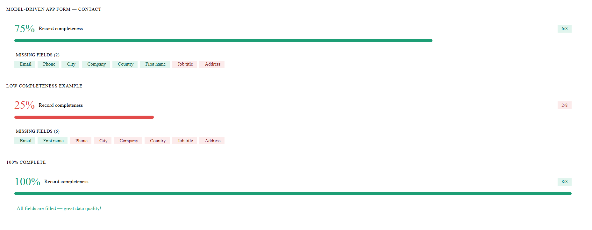

# 📊 Record Completeness Bar — PCF Control

A **Power Apps Component Framework (PCF)** control that displays a **visual completeness score** for any Dataverse record. It evaluates which fields are filled vs. empty and renders a progress bar with color-coded thresholds plus a detailed missing-fields list.

Built with **Fluent UI 9** (React virtual control) for seamless integration in **Model-Driven Apps**.



---

## ✨ Features

| Feature | Description |
|---|---|
| **Visual Progress Bar** | Fluent UI ProgressBar with `large` thickness and `rounded` shape |
| **Color-Coded Thresholds** | 🟢 Green (≥ warning), 🟠 Orange (≥ danger), 🔴 Red (< danger) |
| **Configurable Fields** | Comma-separated list — no code changes needed per entity |
| **Friendly Labels** | Optional display names for each field |
| **Missing Fields Chips** | Visual chip list showing ✅ filled and ❌ missing fields |
| **Responsive** | Works on any form width |
| **Zero External Dependencies** | Only Fluent UI 9 + React (platform libraries) |

---

## 🎯 Use Cases

- **Sales**: Ensure Contact/Account records have email, phone, address, job title before qualification
- **Customer Service**: Validate case records have required fields before escalation
- **Field Service**: Check Work Order completeness before dispatch
- **Any Entity**: Configure for any Dataverse table — just list the fields

---

## 📦 Installation

### Option A: Import Managed Solution

1. Download the latest `.zip` from [Releases](https://github.com/hakimmouchquelita/record-completeness-bar/releases)
2. Go to **make.powerapps.com** → Solutions → Import
3. Select the `.zip` file and follow the wizard

### Option B: Build from Source

```bash
# Prerequisites: Node.js 18+, npm, .NET SDK, PAC CLI

git clone https://github.com/hakimmouchquelita/record-completeness-bar.git
cd record-completeness-bar

npm install
npm run build

# Create a solution project (one-time)
mkdir Solutions && cd Solutions
pac solution init --publisher-name HMQ --publisher-prefix hmq
pac solution add-reference --path ../

# Build the solution .zip
msbuild /t:build /restore
```

The solution `.zip` will be in `Solutions/bin/Debug/`.

---

## ⚙️ Configuration

After importing, add the control to any Model-Driven App form:

### Step 1: Add to Form

1. Open the form editor for your entity (e.g., Contact)
2. Select any **Single Line of Text** field (this is the anchor field)
3. Click **+ Component** → **Get more components** → search for `RecordCompletenessBar`
4. Configure the properties:

### Step 2: Set Properties

| Property | Required | Example | Description |
|---|---|---|---|
| **Fields To Check** | ✅ | `emailaddress1,telephone1,address1_city,jobtitle` | Comma-separated logical names of fields to evaluate |
| **Field Labels** | ❌ | `Email,Phone,City,Job Title` | Friendly labels (same order). Falls back to logical name if omitted |
| **Warning Threshold (%)** | ❌ | `60` | Below this → 🟠 orange bar (default: 60) |
| **Danger Threshold (%)** | ❌ | `30` | Below this → 🔴 red bar (default: 30) |
| **Show Missing Fields List** | ❌ | `true` | Show/hide the chip list below the bar (default: true) |

### Step 3: Publish

Save and publish the form. The control renders immediately on the form.

---

## 🖼️ Screenshots

### High Completeness (Green)
```
[██████████████████████░░] 88%  ✅ Record Completeness
                                    7/8 fields
```

### Medium Completeness (Orange)
```
[██████████████░░░░░░░░░░] 50%  ⚠️ Record Completeness
                                    4/8 fields
```

### Low Completeness (Red)
```
[█████░░░░░░░░░░░░░░░░░░░] 25%  🔴 Record Completeness
                                    2/8 fields
```

---

## 🏗️ Architecture

```
RecordCompletenessBar/
├── ControlManifest.Input.xml    # Component manifest (properties, metadata)
├── index.ts                     # PCF lifecycle class (init, updateView, destroy)
├── CompletenessBar.tsx          # React component (Fluent UI 9)
└── generated/
    └── ManifestTypes.d.ts       # Auto-generated TypeScript interfaces
```

### How It Works

1. **index.ts** reads the `fieldsToCheck` property and evaluates each field via `Xrm.Page.getAttribute()` 
2. It passes the field statuses to the React component
3. **CompletenessBar.tsx** calculates the percentage, applies threshold colors, and renders:
   - A score header with Fluent UI Badge
   - A ProgressBar with appropriate color
   - A list of field chips (filled ✅ / missing ❌)

---

## 🔧 Development

```bash
# Start the test harness
npm start

# Start with hot-reload
npm run start:watch

# Build for production
npm run build

# Lint
npm run lint
```

---

## 🤝 Contributing

Contributions are welcome! Please:

1. Fork the repository
2. Create a feature branch (`git checkout -b feature/my-feature`)
3. Commit your changes (`git commit -m 'Add some feature'`)
4. Push to the branch (`git push origin feature/my-feature`)
5. Open a Pull Request

---

## 📝 Changelog

### v1.0.0 (2026-05-17)
- Initial release
- Fluent UI 9 virtual control
- Configurable fields, labels, thresholds
- Missing fields chip list
- Model-Driven Apps support

---

## 📄 License

[MIT](./LICENSE) — © 2026 [Hakim Mouchquelita](https://www.linkedin.com/in/hakimmouchquelita/)

---

## 🔗 Links

- **PCF Gallery**: *(pending submission)*
- **Author**: [Hakim Mouchquelita](https://www.linkedin.com/in/hakimmouchquelita/) — Solution Architect Power Platform & AI
- **Blog**: [GitHub Pages CV](https://hakimmouchquelita.github.io/CV-Expert-D365-Power-Platform/)
